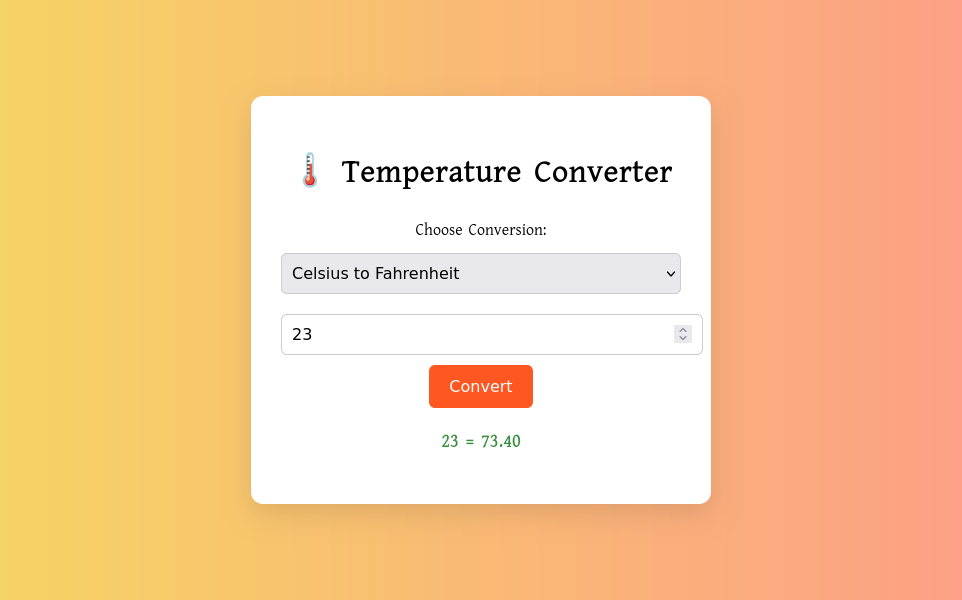
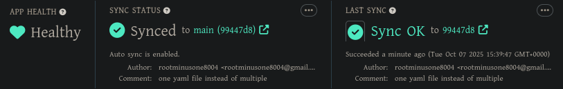

# Project 1

<p align="center">
  
</p>

## Project Overview

This project is a simple JavaScript-based temperature converter web application, served using a lightweight **Flask** backend. The app has been containerized using **Docker** and deployed to a **Kubernetes** cluster with GitOps practices using **ArgoCD**. It also includes real-time monitoring using **Prometheus** and **Grafana**.

## 🛠️ Tech Stack

- **Frontend**: JavaScript (Temperature Converter UI)
- **Backend**: Python (Flask)
- **Containerization**: Docker
- **Orchestration**: Kubernetes, Helm
- **GitOps CD**: ArgoCD
- **Monitoring**: Prometheus & Grafana

## 🚀 Features

- Convert temperatures between Celsius and Fahrenheit
- Dockerized Flask backend serving static JS content
- Declarative deployment to Kubernetes via ArgoCD
- Real-time monitoring dashboards with Grafana
- Metrics collected with Prometheus

## 📦 Deployment

- Open a terminal and clone the project repository:

``` bash
$ git clone "https://github.com/rootminusone8004/project1"
$ cd project1
```

### 🐳 Docker

``` bash
# make the system up
docker compose -f docker-compose.yaml up -d --scale

# tear the system down
docker compose down
```

## 🚀 CI/CD Pipeline

<div align="center">


</div>

## 🔧 infrastructure

This project uses Terraform + Ansible to spin up a Kubernetes cluster with minikube.
- 🔧 Infrastructure provisioning → **Terraform**
- ⚙️ Cluster setup & configuration → **Ansible**
- 🎯 Target: Bare-metal cloud VMs (via SSH) → **AWS EC2**
- 🧠 Bootstrap: `minikube`-based Kubernetes install

### 🧱 Terraform – Infra Provisioning

Terraform handles EC2 instance creation, networking, and any cloud init scripts.

``` bash
$ cd terraform/general
$ terraform init
$ terraform apply -auto-approve
```

[](https://github.com/rootminusone8004/terraform)

### ⚙️ Ansible – Kubernetes Setup

Once the infra is live, Ansible kicks in to install and configure Kubernetes using `kubeadm`

``` bash
$ cd ansible/
$ ansible all -m ping
$ ansible-playbook --ask-become-pass playbooks/minikube.yaml
```

[](https://github.com/rootminusone8004/ansible)

This playbook handles:
- Installing docker
- Installing minikube
- Setting up kubectl access

### 🗺️ Flow Summary

```mermaid
flowchart

    A(Terraform: Provision Infrastructure) --> B(Ansible: Configure Kubernetes)
    B --> C(minikube setup)
    C --> D(Setup Ready ✅)
```

<div align="center">


</div>

## 📸 Dashboards & Monitoring screenshots

### 🔹 ArgoCD (GitOps Management)

<p align="center">
  
  <br><i>Cluster nodes</i>
</p>

<p align="center">
  
  <br><i>Total pods</i>
</p>

<p align="center">
  
  <br><i>Cluster Metrics</i>
</p>

### 🔹 Kubernetes Dashboard

<p align="center">
  
  <br><i>kubernetes deployments</i>
</p>

<p align="center">
  
  <br><i>kubernetes pods</i>
</p>

<p align="center">
  
  <br><i>replica sets</i>
</p>

<p align="center">
  
  <br><i>workload</i>
</p>

<p align="center">
  
  <br><i>Terminal showing pods and services</i>
</p>

### 🔹 Monitoring Stack

#### 📊 Grafana Dashboards

<p align="center">
  <br>
  
  <br><i>CPU metrics</i>
</p>

<p align="center">
  
  <br><i>pods' resource metrics</i>
</p>

#### 📊 Prometheus Dashboards

<p align="center">
  
  <br><i>CPU metrics</i>
</p>

<p align="center">
  
  <br><i>Healthy pods</i>
</p>

## ⚖️ License

This project is licensed under MIT license. See the [LICENSE](LICENSE.txt) file for details.
